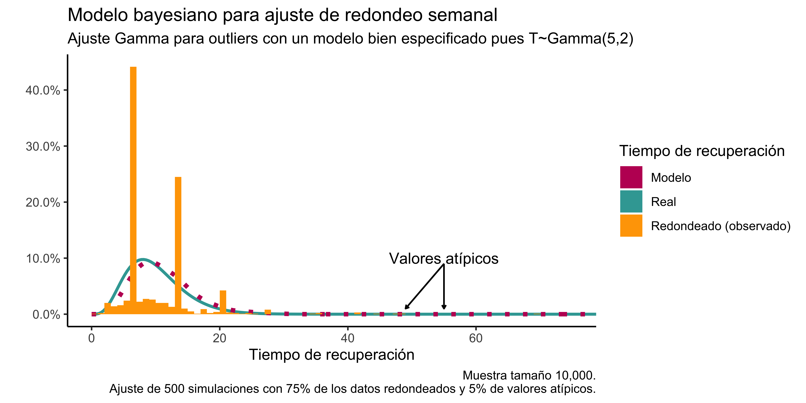
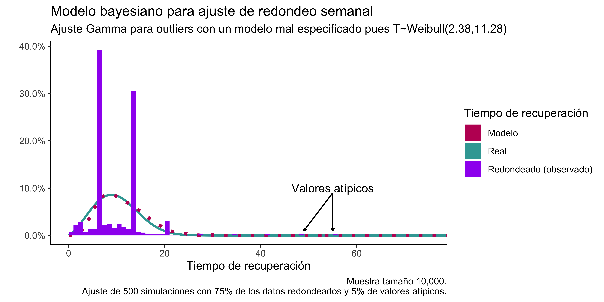

```{r setup, include=FALSE}
library(tidyverse, quietly = T)
library(cowplot)
library(knitr)
set.seed(3904)
opts_chunk$set(echo = TRUE)
opts_chunk$set(fig.width  = 8)
opts_chunk$set(fig.height = 4)
opts_chunk$set(fig.align='center')
```

## Código en Github
Ir a [https://github.com/RodrigoZepeda/ATIPICO](https://github.com/RodrigoZepeda/ATIPICO)

## Descripción del problema

### Objetivo

> Se tiene una base con el tiempo de incapacidad temporal en el trabajo que el equipo médico ha prescrito a los pacientes. Se desea modelar la distribución del tiempo de recuperación controlando por sexo y edad de los pacientes. 

### Consideraciones 

El tiempo que prescriben las y los médicos para incapacidad suele estar redondeado a múltiplos de semana con los valores típicos siendo de 1 a 3 días, luego 7, 14 y 21. Esto no necesariamente está asociado a una razón biológica sino a convenciones sociales (el calendario). Más aún, una proporción pequeña de los datos (estimado < 10%) contiene valores atípicos que pueden referir a errores de registro en la base, errores en el diagnóstico de la enfermedad o casos excepcionales donde por algún motivo la recuperación del paciente toma una cantidad distinta de tiempo. 

> El objetivo entonces es reconstruir la distribución original de tiempo de convalecencia por una incapacidad considerando que los datos están fuertemente sesgados a múltiplos semanales y contienen un porcentaje de valores atípicos. 

## Métodos

La siguientes secciones exponen los métodos. En primer lugar se explica en formato de divulgación la metodología; luego se presenta una versión simplificada del método aplicado y finalmente se describe el método utilizado.

### Idea del método

El modelo considera que todos los pacientes tienen un tiempo de incapacidad que sigue una distribución continua. Un paciente puede recuperarse tanto en el día 14 como en el 1.3 ó el 6.5 significando el primero una recuperación en la mañana del primer día y el segundo que la persona se sintió bien a la mitad de su sexto día. Se supone que dichos días son redondeados para su prescripción de manera artificial a números enteros (para prescribir en días) y, en cierta proporción (no todos), a múltiplos de 7 (para prescribir en semanas). 

La imagen siguiente presenta el tiempo de recuperación real (gráfica izquierda) así como el tiempo de recuperación una vez una proporción se redondea en múltiplos de 7 (gráfica derecha):

```{r, echo = FALSE}
#Simulation distribution
#Gamma para que el modelo esté bien especificado;
#weibull para que no esté bien especificado
simdist <- "gamma" #weibull
shape   <- 5
scale   <- 3

#No todos los datos están redondeados así que se establece un porcentaje
#de cuántos tienen redondeo
perc_redondeado <- 0.75  #Porcentaje de datos redondeados a 7
perc_outliers   <- 0.05 #Se agrega el 1% de outliers
nsims           <- 1000 #Número de simulaciones para el modelo

#Generamos las simulaciones:
if (simdist == "gamma"){
  sample_dist <- function(){rgamma(nsims, shape = shape, scale = scale)}
  dist_fun    <- function(x){dgamma(x, shape = shape, scale = scale)}
} else if (simdist == "weibull"){
  sample_dist <- function(x){rweibull(nsims, shape = shape, scale = scale)}
  dist_fun    <- function(x){dweibull(x, shape = shape, scale = scale)}
} else {
  stop("Distribución inválida selecciona 'gamma' o 'weibull'.")
}

#Simulamos los verdaderos datos filtrados como días (enteros)
datos_distribucion <- sample_dist()
datos_distribucion <- round(datos_distribucion,0)

#Redondeamos la mayoría de los datos a múltiplos de 7 a partir de 3
redondeados <- datos_distribucion
redondear   <- datos_distribucion[datos_distribucion > 3]
a_redondear <- sample(ceiling(perc_redondeado*length(redondear)))
redondear[a_redondear]       <- round(redondear[a_redondear]/7)*7
redondeados[redondeados > 3] <- redondear

#Agregamos outliers
outliers_id <- sample(1:nsims, ceiling(perc_outliers*nsims))
outliers    <- runif(length(outliers_id), 70, 100)
redondeados[outliers_id] <- outliers

plot1 <- ggplot(data.frame(x = datos_distribucion)) +
  geom_histogram(aes(x = x, y = ..density..), 
                 fill = "#39A6A3", 
                 breaks = seq(0,40, by = 1),
                 color = "white") + 
  theme_classic() +
  labs(
    x = "Tiempo de recuperación", 
    y = "",
    title = "Distribución real"
  ) +
  scale_y_continuous(labels = scales::percent)

plot2 <- ggplot(data.frame(x = redondeados)) +
  geom_histogram(aes(x = x, y = ..density..), 
                 fill = "orange", 
                 breaks = seq(0,100, by = 1),
                 color = "white") + 
  theme_classic() +
  labs(
    x = "Tiempo de recuperación", 
    y = "",
    title = "Distribución redondeada"
  ) +
  scale_y_continuous(labels = scales::percent)

cowplot::plot_grid(plot1, plot2, ncol = 2)
```

En los datos observados (gráfica derecha) se modificaron, además, al 5\% de los valores a fin de generar observaciones atípicas de ahí que la gráfica amarilla aparezca con un mayor sesgo a la derecha y valores cercanos a 100. Esto para reflejar de mejor mandera los datos reales.  

El modelo funciona como sigue: para cada padecimiento, grupo de edad y sexo, se supone que una proporción (desconocida) de los datos corresponderá a atípicos. Para cada uno de los datos se analiza _qué es lo más probable_: que el valor sea atípico o que corresponda a los datos reales. Esto permite generar dos bases distintas: las de los probablemente atípicos y la de los probablemente reales. Sobre la base de aquellos clasificados como probablemente reales se busca entonces la mejor distribución de probabilidad que, al momento de muestrear de ella y redondear los resultados, se obtengan observaciones similares a los datos observados. Este proceso se repite múltiples veces para garantizar que los resultados no se deban sólo al azar. 

De manera resumida el proceso está dado por:

  1. Clasificar (de manera aleatoria) algunos de los datos como atípicos.
  
  2. Ajustar un modelo de probabilidad a los datos restantes de tal forma que, al redondear de dicho modelo, se obtengan los resultados más parecidos posibles a lo observado.
  
  3. Repetir. 
  
La siguiente gráfica, resultante de simulaciones (ver más abajo), muestra bajo una base de datos sintética cómo se ve la verdadera distribución de los datos (*real*), cómo resultan los datos observados a partir de ella (*redondeado*) y cómo ajusta el modelo resultante de los pasos anteriores (*modelo*). Dicha base de datos sintética contiene además un 5\% valores atípicos en la derecha que el modelo, adecuadamente, decide no ajustar. 


  
El modelo que aquí se presenta es una adaptación del modelo de variables latentes para redondeo de Gelman _et al_ (CITAR).
  
### Ajuste simple

> Ésta es una explicación más sencilla del ajuste que el modelo completo pues no considera edad ni sexo. 

Para cada paciente $i$, sea $T^{R}_i$ el tiempo prescrito por el médico ya con redondeo. Dicho tiempo está en función del verdadero tiempo de recuperación (desconocido), $T_i$:
$$
T^{R}_i = T_i + \epsilon_i
$$
donde $\epsilon_i$ es el error de redondeo. Si $\epsilon_i = 0$ no hay redondeo en los datos y los observados corresponden a los teóricos. Una cierta proporción de los tiempos observados son en realidad valores atípicos. A estos, los denotamos $T_i^{A}$ y suponemos que: 
$$
T_i^{A} = \mathcal{O}_i + \zeta_i
$$
donde $\mathcal{O}_i$ es la distribución de los atípicos y $\zeta_i$ su error asociado. 

Para cada paciente se observa un valor en la base $T_i^{obs}$, el cual, con probabilidad $1 - \theta$ es un valor atípico:
$$
T_i^{obs} = \begin{cases}
T_i^{R} & \textrm{ con probabilidad } \theta, \\
T_i^{A} & \textrm{ con probabilidad } 1 - \theta. \\
\end{cases}
$$
El ajuste se realiza de manera bayesiana donde se supone:
\begin{equation}
\begin{aligned}
\theta & \sim \textrm{Beta}(0.25,1) \\
T_i|\alpha_R,\beta_R          & \sim \textrm{Gamma}(\alpha_R, \beta_R), \\
\mathcal{O}_i|\alpha_A,\beta_A & \sim \textrm{Gamma}(\alpha_A, \beta_A),
\end{aligned}
\end{equation}
donde $\alpha_k, \beta_j \sim \textrm{HalfCauchy}(0, 2.5)$ para $k,j \in \{R,A\}$. 
Se tienen además las siguientes identidades que relacionan los datos observados con el modelo teórico:
\begin{equation}
\begin{aligned}
T_i & = T_i^{R} + \epsilon_i, \\
\mathcal{O}_i & = T_i^{A} + \zeta_i. \\
\end{aligned}
\end{equation}
donde $\epsilon_i\sim\textrm{Uniforme}(-3.5,3.5)$ es el error de redondeo semanal y $\zeta_i\sim\textrm{Uniforme}(0,1000)$ es el error correspondiente a un valor atípico. 

El modelo puede ser ajustado en `Stan` de la siguiente forma:
```{stan, code=readLines('models/Modelo_Gamma_Outliers.stan'), eval=FALSE, output.var='stanislao'}
```

La siguiente gráfica muestra que incluso si especificamos de manera incorrecta la distribución a priori de $T_i^{R}$ tomándola como Weibull en lugar de Gamma, el modelo de todas maneras ajusta correctamente si $n$ es relativamente grande: 




Código de `R` para generar datos que sigan esta distribución y validar el modelo puede encontrarse en el apéndice. 

### Ajuste controlando por edad, sexo y enfermedad.

Para el ajuste por sexo y edad, para cada enfermedad se establece una regresión donde la media de tiempo de recuperación ($\mu_R$) es de la forma:
$$
\mu_R = \nu_R + \gamma_R\cdot\textrm{Edad}_i + \eta_R\cdot\textrm{Sexo}_i, 
$$
mientras que la media de la distribución de valores atípicos está dada por
$$
\mu_A = \nu_A + \gamma_A\cdot\textrm{Edad}_i + \eta_A\cdot\textrm{Sexo}_i.   
$$
En ambos casos se tiene la parametrización anterior:
\begin{equation}
\begin{aligned}
T_i|\alpha_R,\beta_R          & \sim \textrm{Gamma}(\alpha_R, \beta_R), \\
\mathcal{O}_i|\alpha_A,\beta_A & \sim \textrm{Gamma}(\alpha_A, \beta_A),
\end{aligned}
\end{equation}
donde
$$
\alpha_j = \mu_j/\beta_j
$$
para $j \in\{A,R\}$. Las distribuciones _a priori_ de los nuevos parámetros son: 
\begin{equation}
\begin{aligned}
\nu_j, \beta_j & \sim \textrm{HalfCauchy}(0, 2.5),\\
\gamma_j, \eta_j & \sim \textrm{Normal}(0,10000).
\end{aligned}
\end{equation}
para $k,j \in \{R,A\}$.

El modelo puede ser ajustado en `Stan` de la siguiente forma:
```{stan, code=readLines('models/Modelo_Gamma_Outliers_Edad.stan'), eval=FALSE, output.var='stanislao2'}
```

El ajuste con datos redondeados se ve de la siguiente manera. Cabe recordar que el modelo opera conociendo sólo los datos que provienen del redondeo y desconoce la distribución real. 


El código de `R` para generar datos que sigan esta distribución y validar el modelo puede encontrarse en el apéndice. 

## Apéndice

### Código de R para generar ajuste simple 

El siguiente código genera datos que se comportan de acuerdo al modelo y ajusta una distribución. Si la distribución de los datos coincide con la distribución _a priori_ del modelo entonces el ajuste es perfecto. Si la distribución no coincide de manera completa (por ejemplo teniendo datos Weibull y un modelo Gamma) el ajuste de todas formas es muy bueno: 

```{r, code=xfun::read_utf8('Simulacion_Guias_Estimacion.R'),eval=FALSE}
```

### Código de R para generar ajuste por edad y sexo 

```{r, code=xfun::read_utf8('Simulacion_Guias_Estimacion_por_Edad.R'),eval=FALSE}
```
